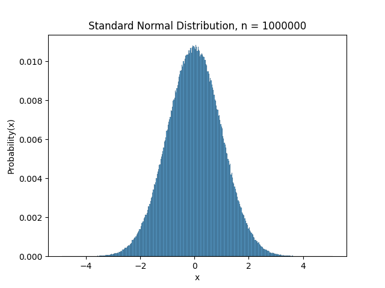
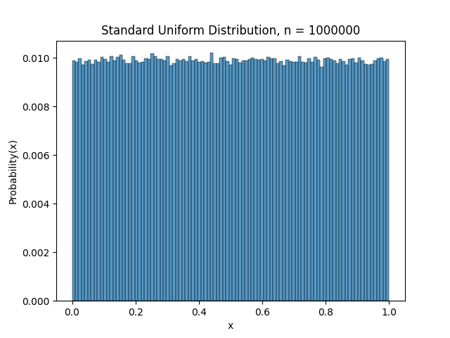
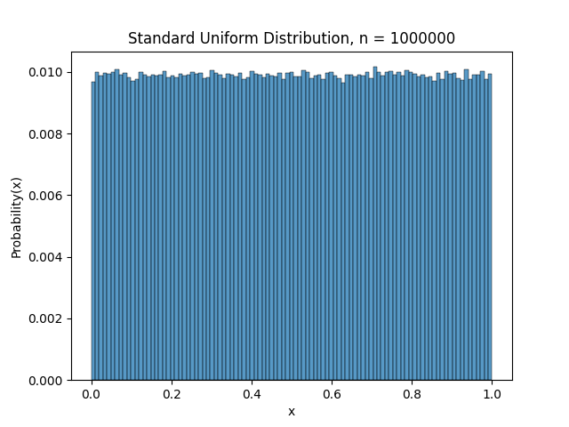
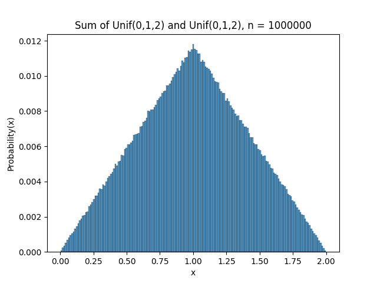

# random_variate_generator

random_variate_generator is a Python library for generating random variates

## Installation

Download zip file.  Unzip contents.

In terminal, navigate to the 'RVgenerator' folder.

Run command:
```bash
pip install dist/random_variate_generator-0.1.0-py3-none-any.whl
```
(Optional) Run tests command:
```bash
python -m unittest tests/test_random_variate.py
```

### Code Locations

The main functions are located in random_variate_generator/random_variate.py

The test functions are located in tests/test_random_variate.py

## Usage

```python
from random_variate_generator import random_variate
RV = random_variate()
```

### Standard Normal RVs Example:
```python
norm = RV.normal_variate(0,1,1000000)
RV.plot("Standard Normal Distribution, n = 1000000")
```


### Combining Distributions:
```python
u1 = RV.uniform_variate(0,1,1000000)
RV.plot("Standard Uniform Distribution, n = 1000000")
```

#### +
```python
u2 = RV.uniform_variate(0,1,1000000)
RV.plot("Standard Uniform Distribution, n = 1000000")
```

#### =
```python
RV.distribution = [u1 + u2 for u1,u2 in zip(u1, u2)]
RV.plot("Sum of Unif(0,1,2) and Unif(0,1,2), n = 1000000")
```


### Other Distribution Functions:
Binomial, Geometric, Poisson, Uniform, Exponential, Normal, Triangular, Weibull, Gamma

## Contributing/Re-Build Instructions

In terminal, navigate to the 'RVgenerator' folder.

Run commands:

```bash
python -m venv venv
```
```bash
venv\Scripts\activate.bat
```
```bash
python setup.py bdist_wheel
```
```bash
pip install dist/random_variate_generator-0.1.0-py3-none-any.whl
```
```bash
python -m unittest tests/test_random_variate.py
```
```bash
venv\Scripts\deactivate.bat
```

